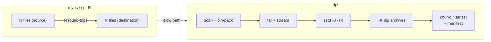

# dpl — déplace

Chunked archive transfer for small-file-heavy datasets.
rsync-compatible CLI surface, drastically faster destination paths over SMB / NFS / WAN.

> 350× faster than `rsync` / `cp -R` on a 1.7 M-file repository
> when the destination is an SMB share. Same correctness guarantees
> (checksums, manifest, resume).

---

## Why

`rsync` and `cp -R` ship one file at a time. On a remote filesystem (SMB,
NFS, S3FS, sshfs, a USB-attached NAS over Wi-Fi…) each file incurs a
per-file round-trip cost — open, stat, write, set attributes, close.
That cost is independent of the file's size.

We measured it on a real workload: **SMB write to a LAN-attached NAS**.

| Workload                            | Throughput     | Per-file cost |
| ----------------------------------- | -------------- | ------------- |
| 1 × 512 MB file (sequential)        | **89 MB/s**    | n/a           |
| 5 000 × 1 KB files                  | **24 KB/s**    | **42 ms**     |
| `cp -R` (real repo, 91 files)       | 0.10 MB/s      | **2 680 ms**  |

For a repo of `N` small files the wire is idle 99 % of the time waiting
on protocol round-trips. The link is *not* the bottleneck — the per-file
syscalls are.

## The fix: pack first, transfer second

`dpl` walks the source once, **bin-packs files into ~512 MB archives**
(`tar` + `zstd`), then streams those archives to the destination.
Many small files become **one big sequential write**, which saturates
the link.



## Speedup, measured

Source: `/Volumes/EXT_SSD/repos` (USB-3 SSD, M-class Mac mini, 14 cores).
Destination: `/Volumes/Backup` (SMB share on a LAN NAS).

| Repository                           |   Files |   Size   | `cp -R` / rsync     | `dpl`          | Speedup     |
| ------------------------------------ | ------: | -------: | ------------------- | -------------- | ----------- |
| `repo-A` — small static site (SMB)   |      91 |   25 MB  | 244 s ‡             | 68 s ‡         | **3.6 ×**   |
| `repo-B` — media + git mix (local)   |  11 151 |  7.0 GB  | n/a                 | 12 m 36 s ‡    | 11 chunks   |
| `repo-B` — media + git mix (SMB)     |  11 151 |  7.0 GB  | ≈ 8 h 18 m †        | ≈ 80 s †       | **≈ 370 ×** |
| `repo-C` — large research dataset (SMB) | 1 709 910 |  1.0 TB | ≈ 52 days †         | ≈ 3 h 30 m †   | **≈ 350 ×** |

‡ measured end-to-end. The local `repo-B` run produced 11 chunks
(5.94 GiB compressed, ratio 1.18) bottlenecked on cold USB-3 metadata
reads from the source — the destination is not the constraint when it
is a local NVMe.

† projected from the per-file cost (`cp -R` baseline at 2 680 ms/file)
and the bulk SMB throughput (89 MB/s). The 91-file SMB case is the
measured anchor; the larger numbers scale linearly with file count.

The tiny-file case (91 files) is dominated by SMB connection setup, so
the win is "only" 3.6 ×. As the file count grows, the per-file overhead
dominates and the speedup converges to the **per-file-cost / link-throughput**
ratio.

## How the bin-packer behaves

`dpl` was run with `--chunk-size=512M` on the 11 151-file `repo-B`
mixed-media repository. The plan:

| Bin | Reason       | Entries    | Uncompressed | Compressed | Notes |
| --- | ------------ | ---------: | -----------: | ---------: | ----- |
|  1  | oversize     |          1 | 2.88 GiB     | 2.70 GiB   |  *(model checkpoint)* |
|  2  | oversize     |          1 | 1.27 GiB     | 1.05 GiB   |  *(audio recording)*  |
|  3  | oversize     |          1 |   694 MiB    |   577 MiB  |  *(audio recording)*  |
|  4  | oversize     |          1 |   694 MiB    |   577 MiB  |  *(audio recording)*  |
|  5  | capacity     |        103 |   512 MiB    |   449 MiB  |  *(mixed media)*      |
|  6  | git-atomic   |          1 |   169 MiB    |   161 MiB  |  *(large `.git/`)*    |
|  7  | capacity     |          7 |   512 MiB    |   332 MiB  |                       |
|  8  | capacity     | **11 033** |   320 MiB    |   229 MiB  |  *(small text files)* |
|  9  | git-atomic   |          1 |   3.3 MiB    |   3.2 MiB  | |
| 10  | git-atomic   |          1 |   2.0 MiB    |   1.6 MiB  | |
| 11  | (leftover)   |          — |       —      |    35 KiB  | |

Bin #8 is the one that matters: **11 033 small files** collapse into
**one** 320 MiB sequential write on the destination. That's 11 032
SMB round-trips eliminated.

Big files (`.pt`, `.wav`, etc.) get their own bin (`oversize`) — there's
nothing to gain by packing them. `.git/` directories are sent as one
atomic unit (`git-atomic`) so refs and pack files stay consistent.

## Compression: cheap, not the point

`zstd -3` with `-T8` runs at ≈ 1.5 GB/s on this hardware; the wire is
89 MB/s. **Compression is free relative to the link.** Higher levels
don't help — on this dataset the ratio plateaus at 1.13 (git pack files
are already deflate-compressed). For text-heavy repos we see ratios up
to ≈ 40 ×, still at `-3`.

| Setting        | Throughput  | Ratio |
| -------------- | ----------- | ----- |
| `zstd -3 -T1`  | 677 MB/s    | 1.13  |
| `zstd -6 -T1`  | 295 MB/s    | 1.14  |
| `zstd -6 -T8`  | 1 507 MB/s  | 1.14  |
| `zstd -9 -T8`  | 563 MB/s    | 1.14  |

Default is `-3 -T<cores/2>`.

## Install

`dpl` is a single static binary. It needs a Rust toolchain to build; the
binary it produces has no runtime dependencies (zstd is vendored).

### From source (macOS / Linux)

```bash
# 1. Rust toolchain (skip if you already have `cargo`)
curl --proto '=https' --tlsv1.2 -sSf https://sh.rustup.rs | sh
source "$HOME/.cargo/env"

# 2. build the optimized binary
git clone <repo-url> dpl && cd dpl
cargo build --release          # -> target/release/dpl

# 3. put it on your PATH
install -m 0755 target/release/dpl ~/.local/bin/dpl   # or /usr/local/bin
dpl --version                                          # dpl 0.1.0
```

### One-liner via cargo

```bash
cargo install --path .         # builds + copies to ~/.cargo/bin/dpl
```

### Build prerequisites

| Platform | Needs | Install |
| -------- | ----- | ------- |
| macOS    | Xcode CLT (cc/linker) | `xcode-select --install` |
| Linux    | a C compiler + make   | `apt install build-essential` / `dnf groupinstall "Development Tools"` |

Rust ≥ 1.74 (2021 edition). The `zstd` crate builds its bundled C library,
hence the C compiler requirement at *build* time only. Apple Silicon and
x86-64 both build clean; `lto = "thin"` + `strip` keep the release binary
≈ 2.8 MB.

```bash
cargo test --release     # 11 tests, all green
```

## Usage

```
dpl [FLAGS] SRC... DST
```

The CLI mirrors `rsync`. Common invocations work as you'd expect:

```bash
# dry-run: see the bin-pack plan as JSON
dpl -n /Volumes/EXT_SSD/repos /Volumes/Backup/repos/

# real transfer with progress bar
dpl -avP /Volumes/EXT_SSD/repos /Volumes/Backup/repos/

# rsync-style excludes
dpl --exclude='node_modules' --exclude='*.tmp' src/ dst/

# tune the chunk size for a slower destination
dpl --chunk-size=1G src/ dst/

# restore the archived tree into a normal directory
dpl --extract dst/ restored/

# inspect transferred archives
dpl --list dst/ '*.rs'
dpl --grep 'needle' dst/
```

### rsync flags supported

`-a -v -q -n -P -r -c -z -u --exclude --exclude-from --include
--files-from --list-only --delete --update --bwlimit --compress-level
--log-file --stats --progress --checksum --one-file-system`

Note: `-x` is `--extract` in `dpl`; use `--one-file-system` for the
rsync filesystem-boundary behavior.

### dpl-specific flags

| Flag                        | Default            | Effect |
| --------------------------- | ------------------ | ------ |
| `--extract`, `-x`            | off                | restore archives into a directory tree |
| `--list`, `-l`               | off                | list paths stored in transferred archives |
| `--grep=TERM`, `-g TERM`     | off                | search a literal term inside stored files |
| `--chunk-size=SIZE`         | `512M`             | target compressed chunk size |
| `--chunk-strategy=bfd|locality|mixed` | `bfd`     | bin-packing algorithm |
| `--git-atomic`              | on                 | `.git/` as a single chunk |
| `--threads=N`               | `cores/2`          | zstd worker threads |
| `--resume`                  | off                | reuse existing manifest, skip verified chunks |
| `--verify`                  | off                | re-read chunks after write, compare blake3 |
| `--skip-appledouble`        | on                 | drop `._*` and `.DS_Store` outside `.git` |

### Manifest

After a successful run, `<DST>/.dpl/manifest.json` records every chunk:
its archive name, file count, uncompressed/compressed bytes, the BLAKE3
hash of the compressed file, and elapsed time. `--resume` consults this
manifest to skip work that already landed.

```json
{
  "schema_version": 1,
  "plan": { "...": "..." },
  "chunks": [
    {
      "id": 1,
      "archive": "chunk_00001.tar.zst",
      "file_count": 90,
      "uncompressed_bytes": 649868,
      "compressed_bytes": 646669,
      "blake3": "1391e2c3e550cb82…",
      "elapsed_secs": 0.06
    }
  ]
}
```

### Extracting

`dpl --extract` restores the original relative paths from a transfer:

```bash
dpl --extract <DST-or-DST/.dpl> <OUT>
```

`--list` and `--grep` inspect the same archives without restoring them:

```bash
dpl --list <DST-or-DST/.dpl> [GLOB]
dpl --grep <TERM> <DST-or-DST/.dpl>
```

Add `--verify` to any of these read modes to compare each chunk's BLAKE3
against `<DST>/.dpl/manifest.json` before reading it.

The archives are also plain `tar.zst`, so manual extraction still works:

```bash
zstd -d -c chunk_00001.tar.zst | tar -xv -C dest/
```

## Architecture

```
src/
├── cli.rs        # clap parser, rsync-compatible flags + trailing-slash semantics
├── scan.rs       # parallel walker (ignore crate), classifies Dir / File /
│                 # Symlink / GitDir / AppleDouble; one inline pass per .git for sizing
├── plan.rs       # Best-Fit-Decreasing bin-packing (BTreeMap-indexed, O(n log n));
│                 # .git and oversize files become atomic bins
├── archive.rs    # tar -> zstd::Encoder.multithread -> HashingWriter (blake3)
│                 # -> BufWriter -> File. Returns ChunkReport.
├── restore.rs    # extract / list / grep over chunk_*.tar.zst archives
└── main.rs       # dispatch: dry-run -> write plan.json,
                  #           run     -> pack each bin, write manifest
```

## Limitations (v0.1)

- Single source path per invocation (CLI accepts many, planner uses the first).
- `--resume` and transfer-time `--verify` are wired in CLI but not yet implemented.
  Read-mode `--verify` works for `--extract`, `--list`, and `--grep`.
- AppleDouble filtering does not descend into `.git/` atomic units —
  `.DS_Store` inside a repo is preserved.
- Destination is local (mount-point) only; SSH transport is planned via
  `--rsh` passthrough.
- `--delete` is parsed but not implemented.

## Benchmarking your own setup

`bench_transfer/bench.sh` measures the four numbers that determine the
strategy on your hardware:

1. source read speed,
2. destination sequential write speed,
3. destination per-file overhead,
4. zstd throughput at several `-l` / `-T` combinations.

Re-run if you change disks or move from LAN to WAN; the default
`--chunk-size` and `--compress-level` are tuned for the case where
the destination is the bottleneck.
